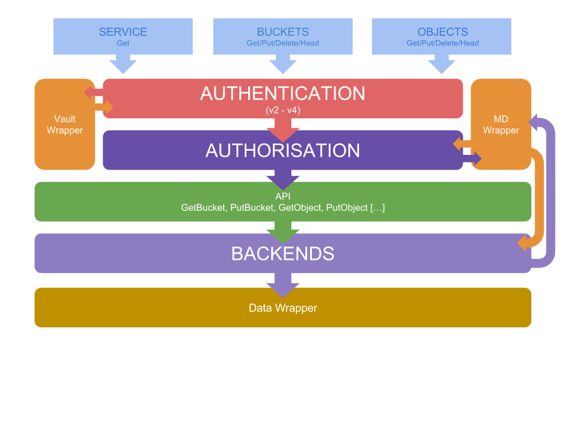

# IronMan-S3 connector

IronMan-S3 handles the requests coming from S3 clients. It is based on the
current amazon-S3 documentation.

## Implementation

### Architecture

IronMan-S3 consists of multiple daemons listening RESTfully to http requests
on a single port. We then route the requests depending on the HTTP verbs
used by the request. Parsing the header allows us to determine the request
type. From there, authentication will be confirmed
by the Vault module using v2 or v4 authentication depending on whether the
client sent a v2 or v4 authentication header. Applicable bucket and object
metadata will be pulled from the metadata backend, IM-Metadata to check proper
authorization (ACL's, IAM and bucket policies). If a user has been
authenticated and is authorized to write/read data, we then proceed to
send the write/read request to our storage backend (RING or IM-Data), before
sending a response to the request sender. Any problem that arises during
the handling of the request due to client error or system error will result
in an error being returned to the client that follows S3's error specifications.

The multi-daemon architecture allows us to restart daemons on the fly in case
of any crash without interrupting the service. The daemon does handle
remaining requests even in case of an error, stopping listening while another
daemon is spawned to handle future requests in its stead.

### Status

Currently, our implementation resides on a single daemon handling every
request. In the near future, the connector will be clusterized, allowing
multiple connectors to handle multiple requests at once.

Our metadata is currently stored on memory, but should use IM-Metadata soon.
For authentication, we use a stubbed implementation, but IM-Vault will be the
final solution.

For the storage part, we are using our in-memory backend, sproxyd and
IM-Data are the backends that we will be integrating in the near future.

### API specifications

Right now, the following operations are implemented:

- PutBucket
- GetBucket
- HeadBucket
- DeleteBucket
- PutBucketACL
- GetBucketACL
- PutObject
- GetObject
- HeadObject
- DeleteObject
- PutObjectACL
- GetObjectACL
- Multipart Upload
- GetService
- v2 Authentication

The following operations are in a WIP state:

- v4 Authentication
