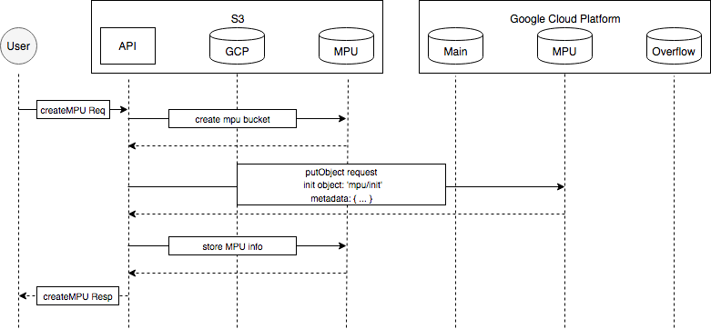
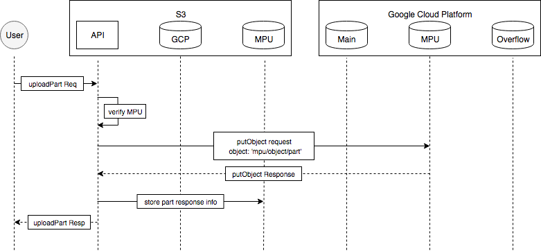
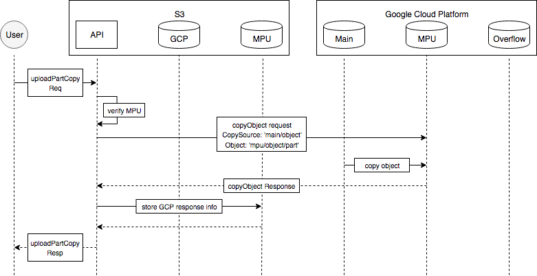
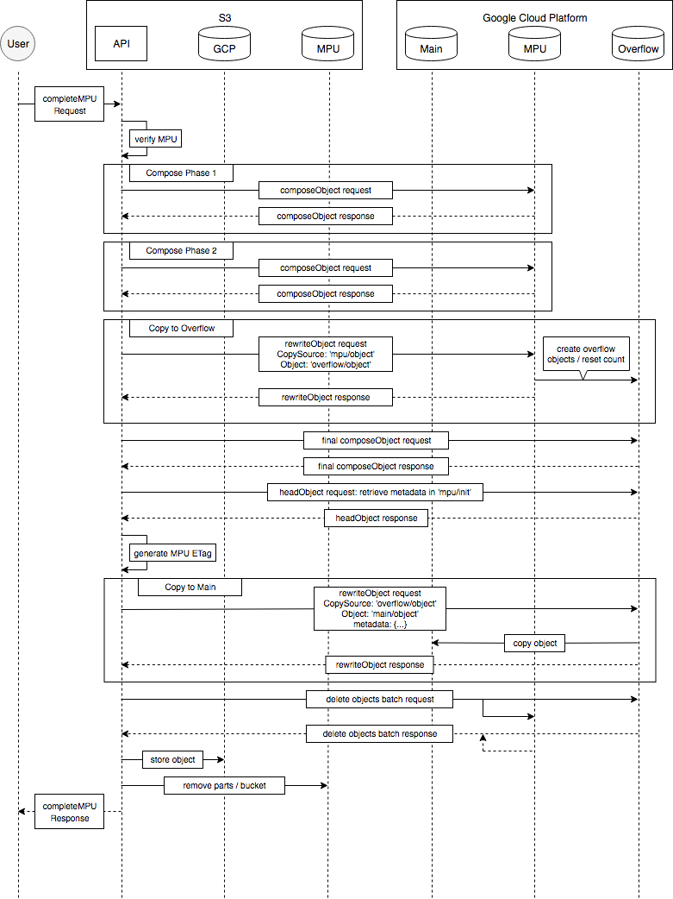
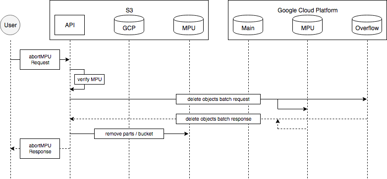

Google Cloud Storage Design
+++++++++++++++++++++++++++

This document will explain the implementation and design of GCP functions.

Object Tagging
--------------

Google Cloud Platform does not have an implementation for object level
tagging like AWS S3.

To implement tagging for objects on GCP, tags are stored as object metadata.
These tagging metadata are prefixed to differentiate tag-metadata from regular
metdata. By default, the prefix is :code:`aws-tag-`; this value can be changed
in the :code:`constants.js` file under :code:`gcpTagginPrefix`.

Multipart Upload
----------------

Google Cloud Platform does not have an implementation for multipart upload like
AWS S3. However, it does supply a :code:`compose` method for merging multiple
objects into a new single object, though with some limitations.

| The limitations of the compose function are:
| - Each compose operation can at most work on 32 objects
| - A generated composite object can have at most 1024 objects used
|
| More information can be found in the following link:
| `<https://cloud.google.com/storage/docs/composite-objects>`__
|

Since multipart upload in AWS can support up to 10,000 parts, the MPU
implementation in GCP should follow. To go beyond the limit of the 1024 parts,
an object's count can be reset by either performing the action of downloading
then reuploading the object or moving an object from one bucket to another
bucket of a different storage class or region.

Using this method, the GCP backend requires that three buckets be set as opposed
to just a single bucket:

- Main Bucket: this is the bucket in which the data will be stored and viewable
  when through S3.
- MPU Bucket: this is the bucket in which the mpu data will be handled, it will
  store the metadata given on createMultipartUpload on the external backend
  and store the intermediate mpu files
- Overflow Bucket: this is the bucket that will be used to perform the reset and
  the compose for the final object

For MPU in GCP, all "helper" objects created process will be
prefixed :code:`${key}-${UploadId}/${phase}/`, where phase can be the following:

- :code:`parts`: when an object is uploaded with either :code:`uploadPart` or
  :code:`uploadPartCopy`
- :code:`mpu1`: for objects completed on the first round of compose
- :code:`mpu2`: for objects completed on the second round of compose
- :code:`final`: for objects transfered to the overflow bucket ready for the
  final merge

Initiate Multipart Upload
^^^^^^^^^^^^^^^^^^^^^^^^^

In GCP, the implemented initiate multipart upload method will store metadata
externally by creating a placeholder object, :code:`${key}-${UploadId}/init` for
each multipart upload. It will also generate an upload id for keeping track of
multipart uploads and to be returned to S3.

  Fig. Create a MPU on S3 with GCP backend

Upload Part
^^^^^^^^^^^

Each uploaded part will be stored as an object in the MPU bucket with the
naming scheme, :code:`${key}-${UplaodId}/parts/${PartNumber}`. The upload part
performs a :code:`putObject` operation with the prefixed key.

  Fig. Upload part to MPU on S3 with GCP backend

Upload Part Copy
^^^^^^^^^^^^^^^^

Each uploaded part will be stored as an object in the MPU bucket with the
naming scheme, :code:`${key}-${UplaodId}/parts/${PartNumber}`.
Upload part copy performs the action of storing with either the :code:`copyObject`
or :code:`rewriteOjbect` operation. :code:`copyObject` operation is the default
method for copying objects, but it the source and destination bucket do not
match, :code:`rewriteObject` will be used instead.
More information can be found in the following doc:
(`<https://cloud.google.com/storage/docs/json_api/v1/objects/copy>`__).

In the case that source object is not from a GCP bucket, :code:`uploadPart` is
performed.

  Fig. Upload part copy to MPU on S3 with GCP backend

Complete Multipart Upload
^^^^^^^^^^^^^^^^^^^^^^^^^

The complete MPU implementation for GCP involves multiple steps:

- Compose Phase 1: the first round of merging. If there is only one part,
  instead of compose, a copyObject operation instead. Creates object with prefix
  :code:`mpu1` (max: 10000 -> 313 parts)
- Compose Phase 2: the second round of merging. If there is only one part,
  instead of compose, a copyObject operation instead. Creates object with prefix
  :code:`mpu2` (max: 313 -> 10 parts)
- Copy to Overflow Bucket: move the composite objects with prefix :code:`mpu2`
  to the Overflow bucket to reset the object composite count. Creates object in
  the Overflow bucket with prefix :code:`final`
- Compose Phase Overflow: the last round of merging to create the final object
  to be moved to the Main bucket
- Copy to Main Bucket: move the completed object into the Main bucket and update
  the objects metadata
- Delete MPU: removes the MPU objects from the MPU bucket and Overflow bucket,
  all live and archived versions related to the MPU.

  Fig. Complete MPU with GCP backend

Abort Multipart Upload
^^^^^^^^^^^^^^^^^^^^^^

The implemented abort multipart upload method will perform the action of
removing all objects related to an upload id from the mpu bucket and the
overflow bucket.

  Fig. Abort MPU with GCP backend
