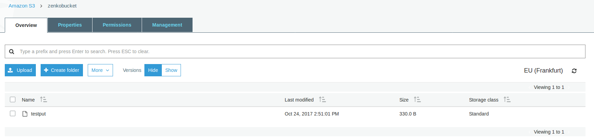
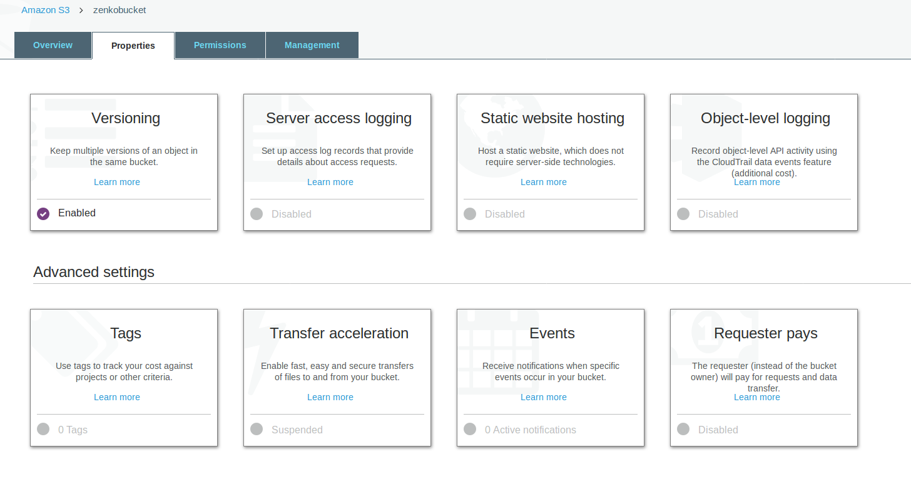
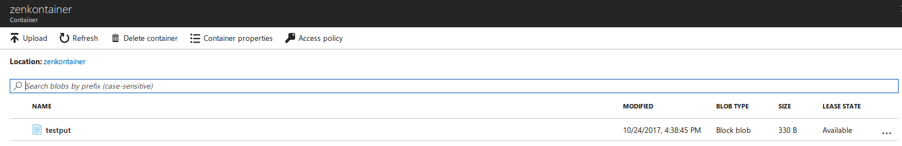

Using Public Clouds as data backends
====================================

Introduction
------------

As stated in our `GETTING STARTED guide <../GETTING_STARTED/#location-configuration>`__,
new data backends can be added by creating a region (also called location
constraint) with the right endpoint and credentials.
This section of the documentation shows you how to set up our currently
supported public cloud backends:

- `Amazon S3 <#aws-s3-as-a-data-backend>`__ ;
- `Microsoft Azure <#microsoft-azure-as-a-data-backend>`__ .

For each public cloud backend, you will have to edit your CloudServer
:code:`locationConfig.json` and do a few setup steps on the applicable public
cloud backend.

AWS S3 as a data backend
------------------------

From the AWS S3 Console (or any AWS S3 CLI tool)
~~~~~~~~~~~~~~~~~~~~~~~~~~~~~~~~~~~~~~~~~~~~~~~~

Create a bucket where you will host your data for this new location constraint.
This bucket must have versioning enabled:

- This is an option you may choose to activate at step 2 of Bucket Creation in
  the Console;
- With AWS CLI, use :code:`put-bucket-versioning` from the :code:`s3api`
  commands on your bucket of choice;
- Using other tools, please refer to your tool's documentation.

In this example, our bucket will be named ``zenkobucket`` and has versioning
enabled.

From the CloudServer repository
~~~~~~~~~~~~~~~~~~~~~~~~~~~~~~~

locationConfig.json
^^^^^^^^^^^^^^^^^^^

Edit this file to add a new location constraint. This location constraint will
contain the information for the AWS S3 bucket to which you will be writing your
data whenever you create a CloudServer bucket in this location.
There are a few configurable options here:

- :code:`type` : set to :code:`aws_s3` to indicate this location constraint is
  writing data to AWS S3;
- :code:`legacyAwsBehavior` : set to :code:`true` to indicate this region should
  behave like AWS S3 :code:`us-east-1` region, set to :code:`false` to indicate
  this region should behave like any other AWS S3 region;
- :code:`bucketName` : set to an *existing bucket* in your AWS S3 Account; this
  is the bucket in which your data will be stored for this location constraint;
- :code:`awsEndpoint` : set to your bucket's endpoint, usually :code:`s3.amazonaws.com`;
- :code:`bucketMatch` : set to :code:`true` if you want your object name to be the
  same in your local bucket and your AWS S3 bucket; set to :code:`false` if you
  want your object name to be of the form :code:`{{localBucketName}}/{{objectname}}`
  in your AWS S3 hosted bucket;
- :code:`credentialsProfile` and :code:`credentials` are two ways to provide
  your AWS S3 credentials for that bucket, *use only one of them* :

  - :code:`credentialsProfile` : set to the profile name allowing you to access
    your AWS S3 bucket from your :code:`~/.aws/credentials` file;
  - :code:`credentials` : set the two fields inside the object (:code:`accessKey`
    and :code:`secretKey`) to their respective values from your AWS credentials.

.. code:: json

    (...)
    "aws-test": {
        "type": "aws_s3",
        "legacyAwsBehavior": true,
        "details": {
            "awsEndpoint": "s3.amazonaws.com",
            "bucketName": "zenkobucket",
            "bucketMatch": true,
            "credentialsProfile": "zenko"
        }
    },
    (...)

.. code:: json

    (...)
    "aws-test": {
        "type": "aws_s3",
        "legacyAwsBehavior": true,
        "details": {
            "awsEndpoint": "s3.amazonaws.com",
            "bucketName": "zenkobucket",
            "bucketMatch": true,
            "credentials": {
                "accessKey": "WHDBFKILOSDDVF78NPMQ",
                "secretKey": "87hdfGCvDS+YYzefKLnjjZEYstOIuIjs/2X72eET"
            }
        }
    },
    (...)

.. WARNING::
   If you set :code:`bucketMatch` to :code:`true`, we strongly advise that you
   only have one local bucket per AWS S3 location.
   Without :code:`bucketMatch` set to :code:`false`, your object names in your
   AWS S3 bucket will not be prefixed with your Cloud Server bucket name. This
   means that if you put an object :code:`foo` to your CloudServer bucket
   :code:`zenko1` and you then put a different :code:`foo` to your CloudServer
   bucket :code:`zenko2` and both :code:`zenko1` and :code:`zenko2` point to the
   same AWS bucket, the second :code:`foo` will overwrite the first :code:`foo`.

~/.aws/credentials
^^^^^^^^^^^^^^^^^^

.. TIP::
   If you explicitly set your :code:`accessKey` and :code:`secretKey` in the 
   :code:`credentials` object of your :code:`aws_s3` location in your
   :code:`locationConfig.json` file, you may skip this section

Make sure your :code:`~/.aws/credentials` file has a profile matching the one
defined in your :code:`locationConfig.json`. Following our previous example, it
would look like:

.. code:: shell

    [zenko]
    aws_access_key_id=WHDBFKILOSDDVF78NPMQ
    aws_secret_access_key=87hdfGCvDS+YYzefKLnjjZEYstOIuIjs/2X72eET

Start the server with the ability to write to AWS S3
~~~~~~~~~~~~~~~~~~~~~~~~~~~~~~~~~~~~~~~~~~~~~~~~~~~~

Inside the repository, once all the files have been edited, you should be able
to start the server and start writing data to AWS S3 through CloudServer.

.. code:: shell

   # Start the server locally
   $> S3DATA=multiple npm start

Run the server as a docker container with the ability to write to AWS S3
~~~~~~~~~~~~~~~~~~~~~~~~~~~~~~~~~~~~~~~~~~~~~~~~~~~~~~~~~~~~~~~~~~~~~~~~

.. TIP::
   If you set the :code:`credentials` object in your
   :code:`locationConfig.json` file, you don't need to mount your
   :code:`.aws/credentials` file

Mount all the files that have been edited to override defaults, and do a
standard Docker run; then you can start writing data to AWS S3 through
CloudServer.

.. code:: shell

   # Start the server in a Docker container
   $> sudo docker run -d --name CloudServer \
   -v $(pwd)/data:/usr/src/app/localData \
   -v $(pwd)/metadata:/usr/src/app/localMetadata \
   -v $(pwd)/locationConfig.json:/usr/src/app/locationConfig.json \
   -v $(pwd)/conf/authdata.json:/usr/src/app/conf/authdata.json \
   -v ~/.aws/credentials:/root/.aws/credentials \
   -e S3DATA=multiple -e ENDPOINT=http://localhost -p 8000:8000
   -d scality/s3server

Testing: put an object to AWS S3 using CloudServer
~~~~~~~~~~~~~~~~~~~~~~~~~~~~~~~~~~~~~~~~~~~~~~~~~~

In order to start testing pushing to AWS S3, you will need to create a local
bucket in the AWS S3 location constraint - this local bucket will only store the
metadata locally, while both the data and any user metadata (:code:`x-amz-meta`
headers sent with a PUT object, and tags) will be stored on AWS S3.
This example is based on all our previous steps.

.. code:: shell

   # Create a local bucket storing data in AWS S3
   $> s3cmd --host=127.0.0.1:8000 mb s3://zenkobucket --region=aws-test
   # Put an object to AWS S3, and store the metadata locally
   $> s3cmd --host=127.0.0.1:8000 put /etc/hosts s3://zenkobucket/testput
    upload: '/etc/hosts' -> 's3://zenkobucket/testput'  [1 of 1]
     330 of 330   100% in    0s   380.87 B/s  done
   # List locally to check you have the metadata
   $> s3cmd --host=127.0.0.1:8000 ls s3://zenkobucket
    2017-10-23 10:26       330   s3://zenkobucket/testput

Then, from the AWS Console, if you go into your bucket, you should see your
newly uploaded object:

Troubleshooting
~~~~~~~~~~~~~~~

Make sure your :code:`~/.s3cfg` file has credentials matching your local
CloudServer credentials defined in :code:`conf/authdata.json`. By default, the
access key is :code:`accessKey1` and the secret key is :code:`verySecretKey1`.
For more informations, refer to our template `~/.s3cfg <./CLIENTS/#s3cmd>`__ .

Pre-existing objects in your AWS S3 hosted bucket can unfortunately not be
accessed by CloudServer at this time.

Make sure versioning is enabled in your remote AWS S3 hosted bucket. To check,
using the AWS Console, click on your bucket name, then on "Properties" at the
top, and then you should see something like this:

Microsoft Azure as a data backend
---------------------------------

From the MS Azure Console
~~~~~~~~~~~~~~~~~~~~~~~~~

From your Storage Account dashboard, create a container where you will host your
data for this new location constraint.

You will also need to get one of your Storage Account Access Keys, and to
provide it to CloudServer.
This can be found from your Storage Account dashboard, under "Settings, then
"Access keys".

In this example, our container will be named ``zenkontainer``, and will belong
to the ``zenkomeetups`` Storage Account.

From the CloudServer repository
~~~~~~~~~~~~~~~~~~~~~~~~~~~~~~~

locationConfig.json
^^^^^^^^^^^^^^^^^^^

Edit this file to add a new location constraint. This location constraint will
contain the information for the MS Azure container to which you will be writing
your data whenever you create a CloudServer bucket in this location.
There are a few configurable options here:

- :code:`type` : set to :code:`azure` to indicate this location constraint is
  writing data to MS Azure;
- :code:`legacyAwsBehavior` : set to :code:`true` to indicate this region should
  behave like AWS S3 :code:`us-east-1` region, set to :code:`false` to indicate
  this region should behave like any other AWS S3 region (in the case of MS Azure
  hosted data, this is mostly relevant for the format of errors);
- :code:`azureStorageEndpoint` : set to your storage account's endpoint, usually
  :code:`https://{{storageAccountName}}.blob.core.windows.name`;
- :code:`azureContainerName` : set to an *existing container* in your MS Azure
  storage account; this is the container in which your data will be stored for
  this location constraint;
- :code:`bucketMatch` : set to :code:`true` if you want your object name to be
  the same in your local bucket and your MS Azure container; set to
  :code:`false` if you want your object name to be of the form
  :code:`{{localBucketName}}/{{objectname}}` in your MS Azure container ;
- :code:`azureStorageAccountName` : the MS Azure Storage Account to which your
  container belongs;
- :code:`azureStorageAccessKey` : one of the Access Keys associated to the above
  defined MS Azure Storage Account.

.. code:: json

    (...)
    "azure-test": {
	"type": "azure",
        "legacyAwsBehavior": false,
        "details": {
          "azureStorageEndpoint": "https://zenkomeetups.blob.core.windows.net/",
	  "bucketMatch": true,
          "azureContainerName": "zenkontainer",
	  "azureStorageAccountName": "zenkomeetups",
	  "azureStorageAccessKey": "auhyDo8izbuU4aZGdhxnWh0ODKFP3IWjsN1UfFaoqFbnYzPj9bxeCVAzTIcgzdgqomDKx6QS+8ov8PYCON0Nxw=="
	}
    },
    (...)

.. WARNING::
   If you set :code:`bucketMatch` to :code:`true`, we strongly advise that you
   only have one local bucket per MS Azure location.
   Without :code:`bucketMatch` set to :code:`false`, your object names in your
   MS Azure container will not be prefixed with your Cloud Server bucket name.
   This means that if you put an object :code:`foo` to your CloudServer bucket
   :code:`zenko1` and you then put a different :code:`foo` to your CloudServer
   bucket :code:`zenko2` and both :code:`zenko1` and :code:`zenko2` point to the
   same MS Azure container, the second :code:`foo` will overwrite the first
   :code:`foo`.

.. TIP::
   You may export environment variables to **override** some of your
   :code:`locationConfig.json` variable ; the syntax for them is
   :code:`{{region-name}}_{{ENV_VAR_NAME}}`; currently, the available variables
   are those shown below, with the values used in the current example:

   .. code:: shell

      $> export azure-test_AZURE_STORAGE_ACCOUNT_NAME="zenkomeetups"
      $> export azure-test_AZURE_STORAGE_ACCESS_KEY="auhyDo8izbuU4aZGdhxnWh0ODKFP3IWjsN1UfFaoqFbnYzPj9bxeCVAzTIcgzdgqomDKx6QS+8ov8PYCON0Nxw=="
      $> export azure-test_AZURE_STORAGE_ENDPOINT="https://zenkomeetups.blob.core.windows.net/"

Start the server with the ability to write to MS Azure
~~~~~~~~~~~~~~~~~~~~~~~~~~~~~~~~~~~~~~~~~~~~~~~~~~~~~~

Inside the repository, once all the files have been edited, you should be able
to start the server and start writing data to MS Azure through CloudServer.

.. code:: shell

   # Start the server locally
   $> S3DATA=multiple npm start

Run the server as a docker container with the ability to write to MS Azure
~~~~~~~~~~~~~~~~~~~~~~~~~~~~~~~~~~~~~~~~~~~~~~~~~~~~~~~~~~~~~~~~~~~~~~~~~~

Mount all the files that have been edited to override defaults, and do a
standard Docker run; then you can start writing data to MS Azure through
CloudServer.

.. code:: shell

   # Start the server in a Docker container
   $> sudo docker run -d --name CloudServer \
   -v $(pwd)/data:/usr/src/app/localData \
   -v $(pwd)/metadata:/usr/src/app/localMetadata \
   -v $(pwd)/locationConfig.json:/usr/src/app/locationConfig.json \
   -v $(pwd)/conf/authdata.json:/usr/src/app/conf/authdata.json \
   -e S3DATA=multiple -e ENDPOINT=http://localhost -p 8000:8000
   -d scality/s3server

Testing: put an object to MS Azure using CloudServer
~~~~~~~~~~~~~~~~~~~~~~~~~~~~~~~~~~~~~~~~~~~~~~~~~~~~

In order to start testing pushing to MS Azure, you will need to create a local
bucket in the MS Azure region - this local bucket will only store the metadata
locally, while both the data and any user metadata (:code:`x-amz-meta` headers
sent with a PUT object, and tags) will be stored on MS Azure.
This example is based on all our previous steps.

.. code:: shell

   # Create a local bucket storing data in MS Azure
   $> s3cmd --host=127.0.0.1:8000 mb s3://zenkontainer --region=azure-test
   # Put an object to MS Azure, and store the metadata locally
   $> s3cmd --host=127.0.0.1:8000 put /etc/hosts s3://zenkontainer/testput
    upload: '/etc/hosts' -> 's3://zenkontainer/testput'  [1 of 1]
     330 of 330   100% in    0s   380.87 B/s  done
   # List locally to check you have the metadata
   $> s3cmd --host=127.0.0.1:8000 ls s3://zenkobucket
    2017-10-24 14:38       330   s3://zenkontainer/testput

Then, from the MS Azure Console, if you go into your container, you should see
your newly uploaded object:

Troubleshooting
~~~~~~~~~~~~~~~

Make sure your :code:`~/.s3cfg` file has credentials matching your local
CloudServer credentials defined in :code:`conf/authdata.json`. By default, the
access key is :code:`accessKey1` and the secret key is :code:`verySecretKey1`.
For more informations, refer to our template `~/.s3cfg <./CLIENTS/#s3cmd>`__ .

Pre-existing objects in your MS Azure container can unfortunately not be
accessed by CloudServer at this time.

For any data backend
--------------------

From the CloudServer repository
~~~~~~~~~~~~~~~~~~~~~~~~~~~~~~~

config.json
^^^^^^^^^^^

.. IMPORTANT::
   You only need to follow this section if you want to define a given location
   as the default for a specific endpoint

Edit the :code:`restEndpoint` section of your :code:`config.json` file to add
an endpoint definition matching the location you want to use as a default for an
endpoint to this specific endpoint.
In this example, we'll make :code:`custom-location` our default location for the
endpoint :code:`zenkotos3.com`:

.. code:: json

  (...)
  "restEndpoints": {
      "localhost": "us-east-1",
      "127.0.0.1": "us-east-1",
      "cloudserver-front": "us-east-1",
      "s3.docker.test": "us-east-1",
      "127.0.0.2": "us-east-1",
      "zenkotos3.com": "custom-location"
  },
  (...)

Backblaze as a data backend
---------------------------

From the Backblaze b2 web page
~~~~~~~~~~~~~~~~~~~~~~~~~~~~~~

From the Backblaze b2 web page, from your Storage Account dashboard, create a bucket where you will host your data for this new location constraint.

You will also need to get one of your b2 application key and to provide it to CloudServer. This can be found from B2 Cloud Storage Buckets dashboard: click on 'Show Account ID and Application Key', then select you account ID and click on 'Create Application Key'.
Important: When you create a new application key, the old one will no longer work.

In this example, our bucket will be named ``b2bucket``.

From the CloudServer repository
~~~~~~~~~~~~~~~~~~~~~~~~~~~~~~~

locationConfig.json
^^^^^^^^^^^^^^^^^^^

Edit `locationConfig.json` to add a new location constraint. This location constraint will contain the information for the Backblaze B2 bucket to which you will be writing your data whenever you create a CloudServer bucket in this location. There are a few `configurable options` here:

- :code:`type` : set to :code:`b2` to indicate this location constraint is writing data to Backblaze B2;
- :code:`legacyAwsBehavior` : always set to :code:`false`;
- :code:`b2StorageEndpoint` :  always set to :code:`api.backblazeb2.com`;
- :code:`b2AccountId` : the B2 Account Id to which your bucket belongs;
- :code:`b2ApplicationKey` : the Application Keys associated to your Account.
- :code:`b2BucketName` : set to an existing bucket in your Backblaze B2 storage account. A non-existing bucket is automatically created;

.. code:: json

  (...)
	"b2-test": {
		"type": "b2",
		"legacyAwsBehavior": false,
		"details": {
			"b2StorageEndpoint": "api.backblazeb2.com",
			"b2AccountId": "123456789",
			"b2ApplicationKey": "9019bdaa70e062f442218ae806ec2a22dd7b2dc0",
			"b2BucketName":"b2bucket"
		}
	},
  (...)

You should now be able to start the server and start writing data to Backblaze through CloudServer.

Start the server with the ability to write to Backblaze
~~~~~~~~~~~~~~~~~~~~~~~~~~~~~~~~~~~~~~~~~~~~~~~~~~~~~~~

Inside the repository, once all the files have been edited, you should be able
to start the server and start writing data to AWS S3 through CloudServer.

.. code:: shell

   # Start the server locally
   $> S3DATA=multiple npm start

 Testing: put an object to Backblaze using CloudServer
 ~~~~~~~~~~~~~~~~~~~~~~~~~~~~~~~~~~~~~~~~~~~~~~~~~~~~~

In order to start testing pushing to Backblaze, you will need to create a local bucket in the Backblaze region - this local bucket will only store the metadata locally, while both the data and any user metadata (x-amz-meta headers sent with a PUT object, and tags) will be stored on Backblaze.

.. code:: shell

	# Create a local bucket storing data in Backblaze
	$> s3cmd --host=127.0.0.1:8000 mb s3://b2bucket --region=b2-test
	# Put an object to Backblaze, and store the metadata locally
	$> s3cmd --host=127.0.0.1:8000 put /etc/hosts s3://b2bucket/testput
	  upload: '/etc/hosts' -> 's3://b2bucket/testput'  [1 of 1]
	  330 of 330   100% in    0s   380.87 B/s  done
	# List locally to check you have the metadata
	$> s3cmd --host=127.0.0.1:8000 ls s3://b2bucket
   	  2017-10-24 14:38       330   s3://b2bucket/testput

Then, from your Backblaze account, if you go into your bucket, you should see your newly uploaded object:

.. WARNING::
	You may experience some latency in the web interface after updating your data on Backblaze. This is due to Backblaze's caching system. It may take several minutes to appear. The refresh button (small arrow) next to 'Buckets/`b2bucket`' into the Browse File page, help displays updated infos faster.

Troubleshooting
~~~~~~~~~~~~~~~

Make sure your :code:`~/.s3cfg` file has credentials matching your local CloudServer credentials defined in :code:`conf/authdata.json`. By default, the access key is accessKey1 and the secret key is verySecretKey1. For more informations, refer to our template ~/.s3cfg .

Pre-existing objects in your Backblaze bucket can unfortunately not be accessed by CloudServer at this time.

 Getting Started
 Testing
 Running functional tests locally:

For the AWS backend, Azure backend and Backblaze backend tests to pass locally, you must modify :code:`tests/locationConfigTests.json` so that :code:`"awsbackend"` specifies a bucketname of a bucket you have access to based on your credentials profile and modify :code:`“azurebackend”` with details for your Azure account.
For Backblaze, modify :code:`"b2backend"` :

.. code:: json

  (...)
	"b2backend": {
		"type": "b2",
		"legacyAwsBehavior": false,
		"details": {
			"b2StorageEndpoint": "api.backblazeb2.com",
			"b2AccountId": "123456789",
			"b2ApplicationKey": "9019bdaa70e062f442218ae806ec2a22dd7b2dc0",
			"b2BucketName":"b2bucket"
		}
	},
	(...)

.. WARNING::
	The name must be "b2backend" for the tests to work properly !!
